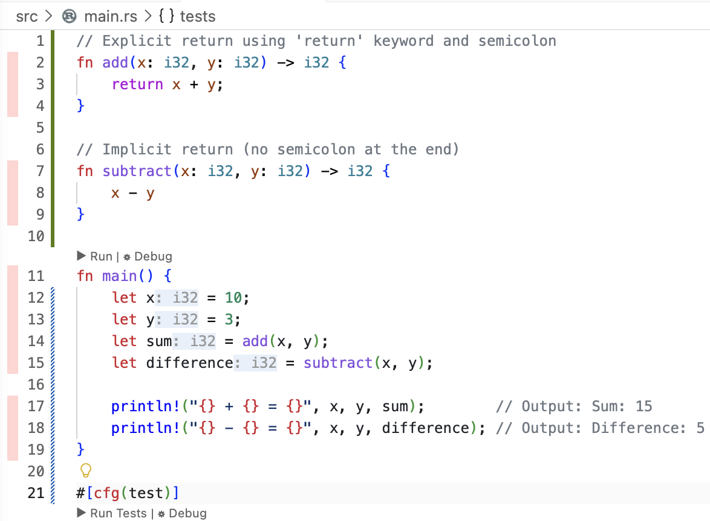

# rust-code-coverage

A sample rust porject demonstrating code coverage

## create rust project
```shell
# create a rust project
cargo init
# run the project, prints Hello, world!
cargo run
```

## install test coverage tools
```shell
cargo install cargo-nextest --locked
cargo +stable install cargo-llvm-cov --locked
rustup component add llvm-tools-preview
```

## impement sample functions with dummy test
```rust
// Explicit return using 'return' keyword and semicolon
fn add(x: i32, y: i32) -> i32 {
    return x + y;
}

// Implicit return (no semicolon at the end)
fn subtract(x: i32, y: i32) -> i32 {
    x - y
}

fn main() {
    let x = 10;
    let y = 3;
    let sum = add(x, y);
    let difference = subtract(x, y);

    println!("{} + {} = {}", x, y, sum);        // Output: Sum: 15
    println!("{} - {} = {}", x, y, difference); // Output: Difference: 5
}

#[cfg(test)]
mod tests {
    #[test]
    fn dummy_test() {
        assert!(true);
    }
}
```

```shell
# run the project, prints the following lines
# 10 + 3 = 13
# 10 - 3 = 7
cargo run
```

## run test and display coverage
```shell
# run test with coverage, console report shows missing stats
cargo llvm-cov nextest
# run test with coverage to generate lcov which can be used by Coverage Gutters extension
cargo llvm-cov nextest --lcov --output-path ./target/lcov.info
```

Enable `Coverage Gutters: Display Coverage` in VS Code



## run test in watch mode
```shell
# install bacon to watch
cargo install --locked bacon
# Add `coverage` job to bacon.toml
# run test in watch mode
bacon coverage

# enable Coverage Gutters: Watch in VS Code
```

Note: Coverage Gutters: Watch does not seem to work on codespaces

Use `Cmd + Shift + 7` to refresh coverage gutters

Played with following vscode settings
```json
{
    "coverage-gutters.watchOnActivate": true,
    "coverage-gutters.coverageBaseDir": "target",
    "coverage-gutters.coverageFileNames": [
        "lcov.info"
    ],
    "coverage-gutters.manualCoverageFilePaths": [
        "/workspaces/rust-code-coverage/target/lcov.info"
    ],
}
```

## vscode extentions
Use `ryanluker.vscode-coverage-gutters` to display test coverage generated by lcov or xml in your editor.